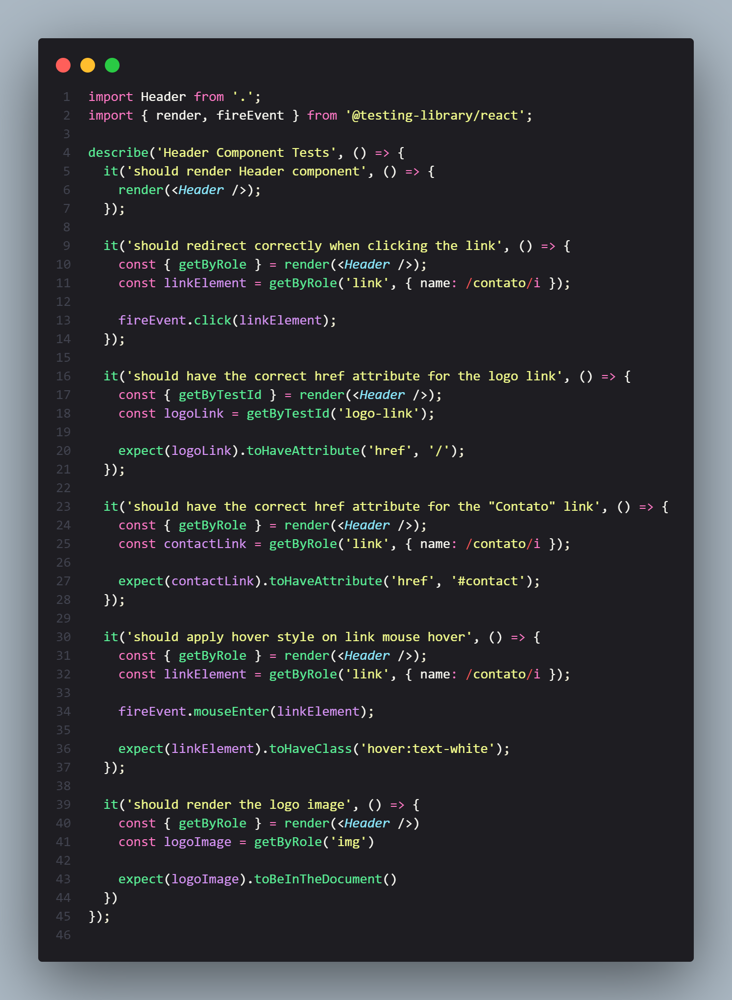
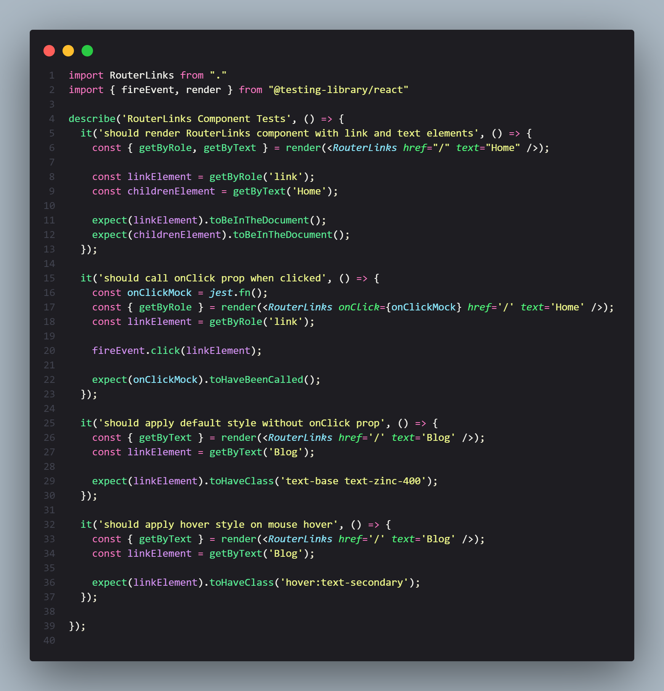

</h1>
   
<h1>Testes com Jest</h1>

## Descrição

### Testes Básicos com Jest: Componente Header
Este repositório ilustra a implementação de princípios fundamentais de testes por meio do framework [jest](https://jestjs.io/pt-BR/docs/getting-started). Dentro deste projeto, você terá acesso a um exemplo abrangendo a configuração do Jest e a execução de testes unitários em um componente Header. O Header é um elemento-chave em diversas aplicações, pois engloba links, rotas, textos e estilos que constituem a estrutura de navegação da interface. Além disso, o teste também considera a funcionalidade de abertura de modais no menu mobile. Através dessa abordagem, buscamos garantir a qualidade, estabilidade e confiabilidade do componente, assim como demonstrar boas práticas de teste em projetos React.

### Recursos Destacados:
A abordagem adotada neste projeto consistiu em criar os testes após a implementação do código, com foco na validação das funcionalidades do componente. Através dos testes unitários, foi possível verificar se o componente estava se comportando conforme o esperado em diversas situações, como cliques em links, interações de usuário e ajustes de estilo.

Os testes foram organizados de forma a abranger casos de uso relevantes para o componente, garantindo que ele continuasse funcionando corretamente mesmo após futuras atualizações ou modificações no código. Além disso, foram definidos cenários de teste abrangentes para garantir a cobertura dos principais fluxos de interação.

A implementação dos testes unitários permitiu aumentar a confiança na integridade do componente e proporcionou uma forma eficaz de detectar e corrigir possíveis problemas à medida que o código evoluía. A utilização do Jest como ferramenta de testes proporcionou uma experiência simplificada e uma visão abrangente do status da cobertura e do comportamento do componente.

[Ver Projeto](https://basic-test-with-jest.vercel.app/)

#

#

 

## 🛠️ Tecnologias

💻 **Front-end**
- [Next.js 13.4](https://nextjs.org)
- [Typescript](https://www.typescriptlang.org)

📚 **Bibliotecas**
- [jest](https://jestjs.io/pt-BR/docs/getting-started)
- [testing-library](https://testing-library.com/)
- [heroicons](https://heroicons.com/)

🎨 **Estilização**
- [tailwindcss](https://tailwindcss.com/docs/installation)

🔋 **Versionamento e Deploy**
- [Git](https://git-scm.com)
- [Vercel](https://vercel.com/)

 

⚙️ **Configuranções e Instalações**

Clone do Projeto

    $ git clone https://github.com/renovatt/basic-test-with-jest.git
Instalando as dependências

    $ npm install

Iniciando o projeto

    $ npm run dev

 

**Como contribuir?**

- Você pode dar suporte me seguindo aqui no GitHub
- Dando uma estrela no projeto
- Criar uma conexão comigo no linkedin fazendo parte da minha networking e curtir o meu projeto.

 

**Autor**
[Wildemberg Renovato de Lima](https://www.linkedin.com/in/renovatt/)